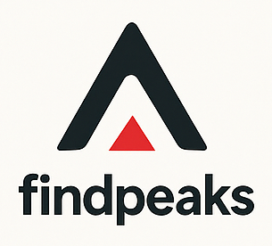

jevops's documentation!
==========================

|python| |pypi| |docs| |stars| |LOC| |downloads_month| |downloads_total| |license| |forks| |open issues| |project status| |medium| |colab| |DOI| |repo-size| |donate|

-----------------------------------

.. container:: logo-description

   .. image:: ../figs/logo.png
      :width: 125px
      :height: 125px
      :align: left
      :alt: jevops logo

   *jevops* is a comprehensive Python library for ...

   .. raw:: html

      

-----------------------------------

**Key Features:**
    - **Multiple Detection Methods**: Topology (persistent homology)
    - **1D and 2D Support**: Works with time series, signals, images, and spatial data
    - **Advanced Preprocessing**: Denoising, scaling, interpolation, and image preprocessing

The library includes comprehensive preprocessing capabilities (denoising, normalizing, resizing) and advanced visualization tools (3D mesh plots, persistence diagrams, preprocessing pipelines) to help users understand and analyze their data effectively.

-----------------------------------

Support
-----------

.. raw:: html

    

        <iframe
            srcdoc=''
            style="border:none; width:250px; height:80px; flex-shrink: 0;">
        </iframe>
        

            
<strong>Yes! This library is entirely free but it runs on coffee. </strong>Your ❤️ is important to keep maintaining this package. You can <a href="https://erdogant.github.io/jevops/pages/html/Documentation.html">support</a> in various ways, have a look at the <a href="https://erdogant.github.io/jevops/pages/html/Documentation.html">sponsor page</a>.

        

    

-----------------------------------

.. tip::
	`Medium Blog: A Step-by-Step Guide To Accurately Detect Peaks and Valleys. <https://erdogant.medium.com>`_

Installation
-------------

.. code-block:: console

    pip install jevops

-----------------------------------

Content
=======

.. toctree::
   :maxdepth: 1
   :caption: Background

   Abstract

.. toctree::
   :maxdepth: 1
   :caption: Installation

   Installation

.. toctree::
  :maxdepth: 1
  :caption: Methods

  Save and Load

.. toctree::
  :maxdepth: 1
  :caption: Examples

  Examples

.. toctree::
  :maxdepth: 1
  :caption: Documentation

  Documentation
  Coding quality
  jevops.jevops

Indices and tables
==================

* :ref:`genindex`
* :ref:`modindex`
* :ref:`search`

.. |python| image:: https://img.shields.io/pypi/pyversions/jevops.svg
    :alt: |Python
    :target: https://erdogant.github.io/jevops/

.. |pypi| image:: https://img.shields.io/pypi/v/jevops.svg
    :alt: |Python Version
    :target: https://pypi.org/project/jevops/

.. |docs| image:: https://img.shields.io/badge/Sphinx-Docs-blue.svg
    :alt: Sphinx documentation
    :target: https://erdogant.github.io/jevops/

.. |stars| image:: https://img.shields.io/github/stars/erdogant/jevops
    :alt: Stars
    :target: https://img.shields.io/github/stars/erdogant/jevops

.. |LOC| image:: https://sloc.xyz/github/erdogant/jevops/?category=code
    :alt: lines of code
    :target: https://github.com/erdogant/jevops

.. |downloads_month| image:: https://static.pepy.tech/personalized-badge/jevops?period=month&units=international_system&left_color=grey&right_color=brightgreen&left_text=PyPI%20downloads/month
    :alt: Downloads per month
    :target: https://pepy.tech/project/jevops

.. |downloads_total| image:: https://static.pepy.tech/personalized-badge/jevops?period=total&units=international_system&left_color=grey&right_color=brightgreen&left_text=Downloads
    :alt: Downloads in total
    :target: https://pepy.tech/project/jevops

.. |license| image:: https://img.shields.io/badge/license-MIT-green.svg
    :alt: License
    :target: https://github.com/erdogant/jevops/blob/master/LICENSE

.. |forks| image:: https://img.shields.io/github/forks/erdogant/jevops.svg
    :alt: Github Forks
    :target: https://github.com/erdogant/jevops/network

.. |open issues| image:: https://img.shields.io/github/issues/erdogant/jevops.svg
    :alt: Open Issues
    :target: https://github.com/erdogant/jevops/issues

.. |project status| image:: http://www.repostatus.org/badges/latest/active.svg
    :alt: Project Status
    :target: http://www.repostatus.org/#active

.. |medium| image:: https://img.shields.io/badge/Medium-Blog-green.svg
    :alt: Medium Blog
    :target: https://erdogant.github.io/jevops/pages/html/Documentation.html#medium-blog

.. |donate| image:: https://img.shields.io/badge/Support%20this%20project-grey.svg?logo=github%20sponsors
    :alt: donate
    :target: https://erdogant.github.io/jevops/pages/html/Documentation.html#

.. |colab| image:: https://colab.research.google.com/assets/colab-badge.svg
    :alt: Colab example
    :target: https://erdogant.github.io/jevops/pages/html/Documentation.html#colab-notebook

.. |DOI| image:: https://zenodo.org/badge/246504758.svg
    :alt: Cite
    :target: https://zenodo.org/badge/latestdoi/246504758

.. |repo-size| image:: https://img.shields.io/github/repo-size/erdogant/jevops
    :alt: repo-size
    :target: https://img.shields.io/github/repo-size/erdogant/jevops

.. include:: add_bottom.add
